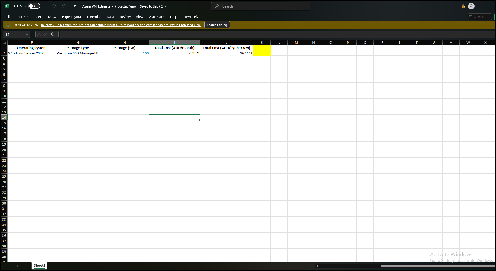
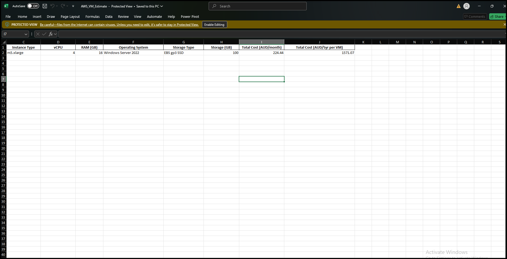

# 4.2 Cloud Services

In the current situation, the organization keeps all types of data and servers at headquarters; however, it is shifting some parts to the cloud. Therefore, this task explores, evaluates, and recommends multiple cloud services better suited for operations.

## Cloud Server Comparison

| Feature | Microsoft Azure | Amazon Web Services (AWS) |
|----------|------------------|---------------------------|
| **Data-center location** | Australia East (Sydney), Australia Southeast (Melbourne) | Access Point Southeast-2 (Sydney) |
| **Virtual machine estimation** | D4s v3 – 4 vCPU, 16 GB RAM | m5.xlarge – 4 vCPU, 16 GB RAM |
| **Operating System** | Windows Server 2022 (64-bit) | Windows Server 2022 (64-bit) |
| **Storage size (each VM)** | 100 GB | 100 GB |
| **Virtual machine rent (monthly)** | AUD $227 | AUD $221 |
| **5-year plan cost** | ≈ AUD $95,369 | ≈ AUD $92,830 |
| **Hybrid Integration** | Seamless with Windows Server, Active Directory, Microsoft 365, Azure Arc | Possible via AWS Directory Service and AD Connector (less native) |

### Azure VM Cost Estimation

| Provider | Region | Instance Type | vCPU | RAM | OS | Storage Type | Storage (GB) | Cost (AUD/month) | Cost (AUD/5yr per VM) |
|-----------|---------|----------------|------|-----|----|---------------|---------------|------------------|-------------------------|
| Microsoft Azure | Australia East (Sydney) | D4s_v3 | 4 | 16 | Windows Server 2022 | SSD Managed Disks | 100 | 239.59 | 1677.11 |

## Cloud Service Price Estimates (Azure)

### AWS VM Cost Estimation

.xlsx)

| Provider | Region | Instance Type | vCPU | RAM | OS | Storage Type | Storage (GB) | Cost (AUD/month) | Cost (AUD/5yr per VM) |
|-----------|---------|----------------|------|-----|----|---------------|---------------|------------------|-------------------------|
| Amazon Web Services (AWS) | ap-southeast-2 (Sydney) | m5.xlarge | 4 | 16 | Windows Server 2022 | EBS gp3 SSD | 100 | 224.44 | 1571.07 |

## Recommendations

- **Azure** is recommended for organizations heavily using Windows or SQL Server due to smooth hybrid integration, simplified migration, and data management.  
- **AWS** is recommended when cost optimization is critical, as it offers slightly cheaper on-demand services.  
- For **small to medium organizations** using Microsoft products, Azure provides maximum flexibility and better integration.

