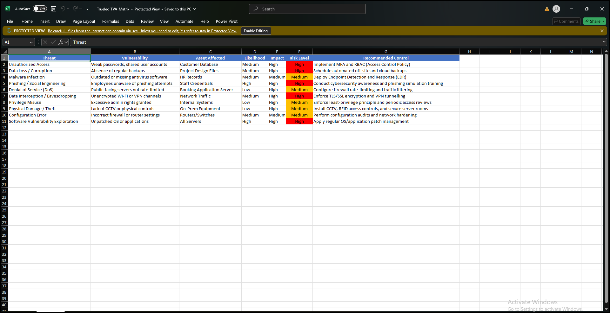

# 4.3 Security

## 4.3.1 Cyber Security Risk Assessment

### Overview
A detailed security risk assessment was conducted on Truelec’s network using available resources. The results identified multiple critical assets, threats, and vulnerabilities according to their risk levels.

**Key Finding:**  
The **database** received the highest risk rating due to high business impact, potential unauthorized access, and software vulnerabilities. Data breaches could cause significant financial and reputational damage.

[https://github.com/sumith-cqu/cocit20246-2025-t2-project-bne-project-sumith-saiganesh/blob/main/Truelec_TVA_Risk_Assessment%20(1).xlsx](https://github.com/sumith-cqu/cocit20246-2025-t2-project-bne-project-sumith-saiganesh/blob/main/Truelec_TVA_Risk_Assessment%20(1).xlsx)

## TVA Matrix

## 4.3.2 Recommended Security Controls

Based on the **NIST SP 800-53** framework, three key security controls were selected to mitigate the identified risks and protect the customer database.

### Benefits
- Reduces data breach and unauthorized access risks.  
- Improves overall confidentiality, integrity, and availability.  
- Minimal negative impact on users, with a positive effect on network resilience.

